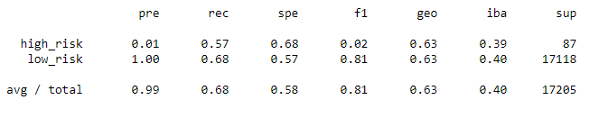
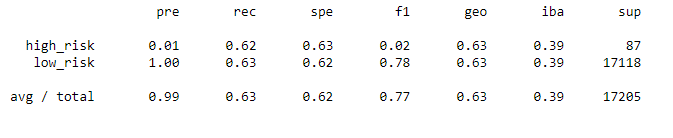
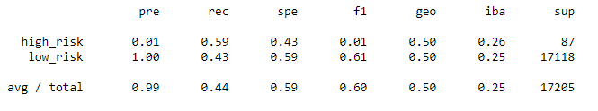
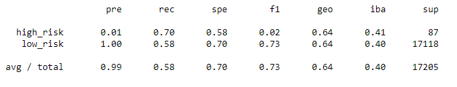
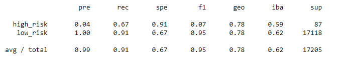
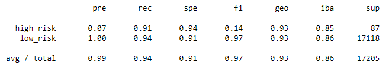

# Credit_Risk_Analysis

##Overview of Analysis: 
The purpose of this analysis is to evaluate different machine learning modules to determine which model is better at predicting credit risk.

## Results of Analysis

### Naive Random Oversampling
Balanced Accuracy Score = 0.6293939430565123 

### SMOTE Oversampling
Balanced Accuracy Score = 0.6277008271188627 

### Undersampling
Balanced Accuracy Score = 0.5104185551808743 

### Combination Sampling
Balanced Accuracy Score = 0.6411460410698961 

### Balanced Random Forest Classifier
Balanced Accuracy Score = 0.7877672625306695 

### Easy Ensemble AdaBoost Classifier
Balanced Accuracy Score = 0.925427358175101 

## Summary
In regard to the accuracy score for each model, 4 of the 6 had a pretty low accuracy score (under .65).  Of those remaining, we find a .78 and .92.  As we know, the accuracy score is helpful, but we really need to take a look at the precision and sensitivity to access our model's performance. First, a review of the 4 model's that resulted in a lower accuracy score, we find that the precision  for each is .99, but the sensitivity (the measure of how many false negatives) in the lower percentages.   For the models that had a high accuracy score, we find that the precision for each is .99 (same as all other model's), but find a much higher precision for both of these model's.

With the results above, I would recommend using the Easy Ensemble Classifier to predict credit risk.  The reason for this is because this particular model has the highest accuracy score, precision and sensitivity.  The high precision indicates that the model accurately predicts those who are at risk while the sensitivity indicates that there is a high accuracy of the model predicting correctly those who would be high risk for credit.
